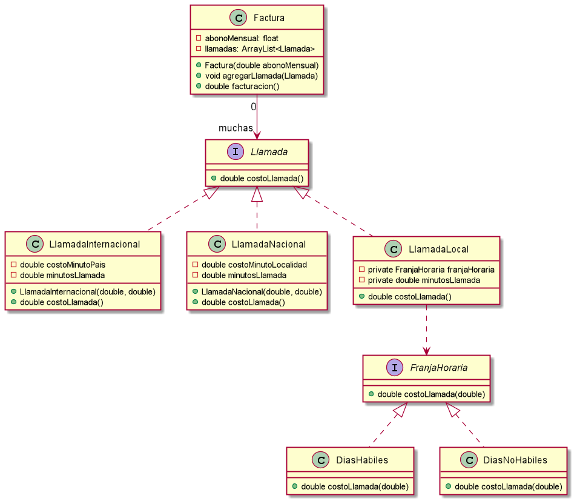
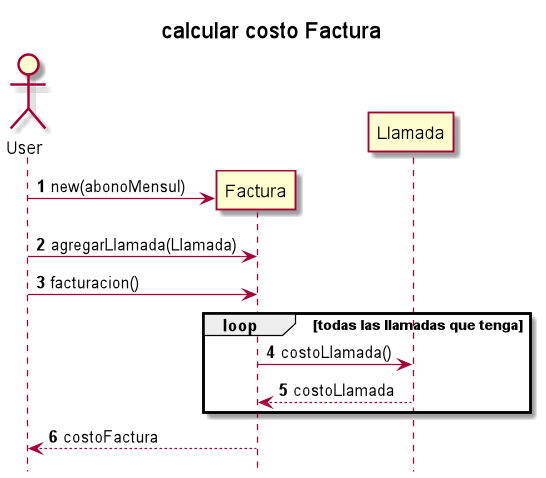

 

# Ejercicio Mercap - Santiago Curetti

Implementar en el lenguaje orientado a objetos que más te guste el siguiente ejercicio.
Realizar un sistema de facturación de llamadas telefónicas teniendo en cuenta los siguientes requerimientos:
1) La facturación se realiza de manera mensual
2) La facturación está compuesta por:
   a. Un abono mensual básico
   b. Consumo por llamadas Locales
   c. Consumo por llamadas Nacionales e Internacionales
3) Las llamadas locales tienen distintos valores según la franja horaria en la que se realizan y el día. Para los días hábiles, de 8 a 20 hrs. el costo es de 0,20 centavos el minuto, mientras en el resto de las horas es de 0,10 centavos el minuto. Los sábados y domingos cuesta 0,10 centavos el minuto
4) Las llamadas Internacionales tienen un costo distinto según el país al que se llame
5) Las llamadas Nacionales tienen un costo distinto según la localidad a la que se llame
   Consideraciones adicionales:
6) No es necesario realizar una interfaz de usuario visual.
7) No es necesario realizar persistencia de los datos (o sea, conexión a base de datos, archivos, etc.). Alcanza con simular los datos creándolos en memoria
8) Como salida alcanza ver por pantalla como sería una factura (sin preocuparse por darle un formato especial)

## Desarrollo

Programacion orientada a objetos, aplicando TDD.

##Diagramas

